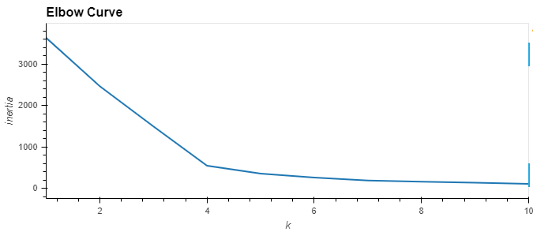
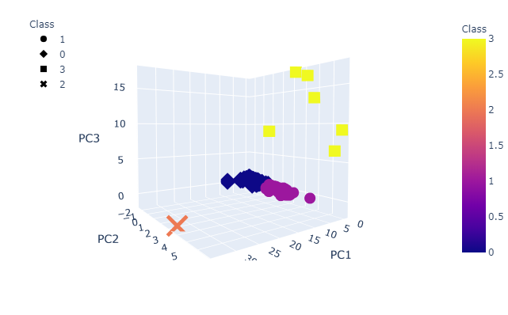
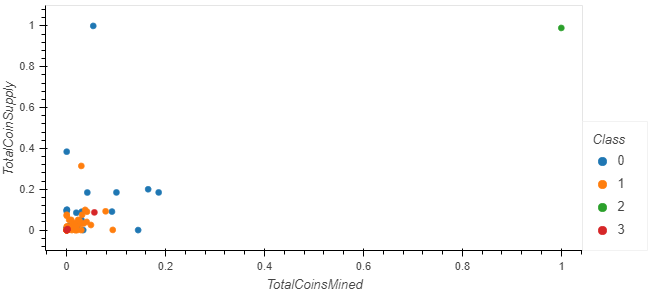

# Analyzing Cryptocurrencies through Unsupervised Machine Learning

### Overview
This project utilizes the unsupervised clustering algorithm to categorise cryptocurrency data from [Crypto Compare](https://www.cryptocompare.com/). The coins are categorized based on the following information:
 - Coin Algorithm
 - Mining Activity
 - Total Mined Coins
 - Total Coins Supply

### Data

Raw data from Crypto Coin

Data with dummy variables for Algorithm and ProofType 

Data after using PCA to reduce to 3 features

Elbow Curve to determine the number of clusters to be used with KMeans

HVPlot showing the different classes of Coins against the PC1, PC2 and PC3 axis

Scatter Plot of the coins according to the clustered classes

### Summary
The KMeans clustering algorithm was able to segregate the coins based on the basic structural data for each coin. 
Next step: To validate the effectiveness of the clustering, the actual performance of the coins in each class should be measured. 