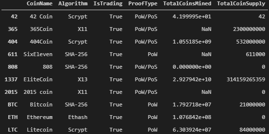
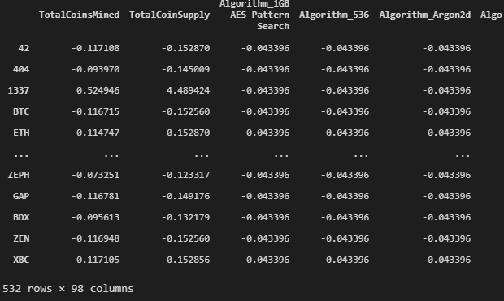
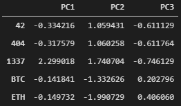

# Analyzing Cryptocurrencies through Unsupervised Machine Learning

### Overview
This project utilizes the unsupervised clustering algorithm to categorise cryptocurrency data from [Crypto Compare](https://www.cryptocompare.com/). The coins are categorized based on the following information:
 - Coin Algorithm
 - Mining Activity
 - Total Mined Coins
 - Total Coins Supply

### Data

Raw data from Crypto Coin

Data with dummy variables for Algorithm and ProofType 

Data after using PCA to reduce to 3 features

Elbow Curve to determine the number of clusters to be used with 